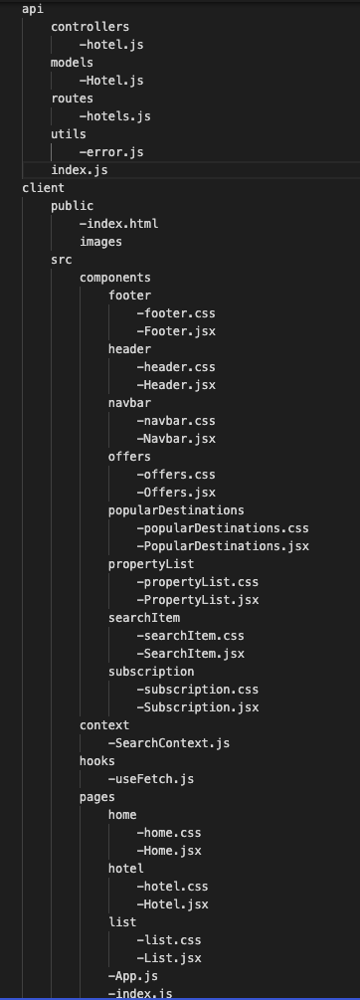

# Full-Stack Booking Website Clone with React and MongoDB

## 1. Preview

## 2. Description

In this project, Booking.com website's some pages and features have been cloned with React. The data has been provided by a REST API using Node.js, Express and MongoDB.

## 3. Structure Tree

## 4. Application

- This project created by using

  
  
  
  
   
   
     
 

## 5. Must Haves

- The data must be provided by a database.

- A user should be able to enter a city name and check-in check-out date and number of people in the search bar.

- A user should be able to see a calendar and choose a range of date with a click.

- A user should be able to see the page of the hotels and list of hotels according to their search when they click on the search button.

## 6. Nice-to Have

- A user should be able to slide the photos belonging the hotel that they choose.
